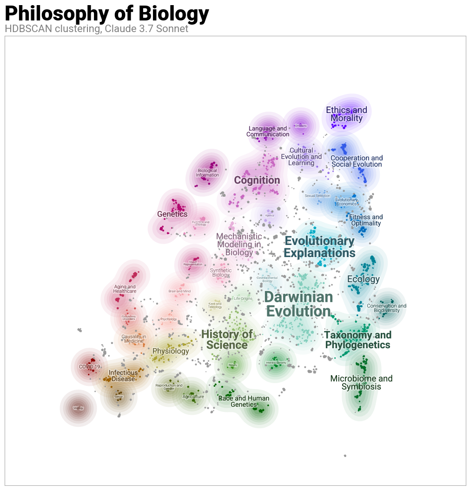

# A Concerning Estrangement ? The Case of Philosophy of Biology And The Biological Sciences 
## What is this repo about?
This Github repo is to keep track of the computational work I did during my master thesis. In it, I looked at the estrangement between philosophy of biology and biology. Specifically, I used tools aminly topic modeling (see below) and citation analysis to assess the current relationship of the two endeavors. This relationship was considered under two aspects. The first one was thematic diversity, i.e. 'are philosopher interested in the biological thematics that interest biologists?'. The second one was citational, 'how are philosopher citing biology?', 'are they able to keep themselves up to date with the contemporary production in biology?'. I also looked at the visibility of both disciplines through time, that is what is the evolution of the citations going from one discipline to the other. This gives us two relationships to investigate : _biology_ → _philosophy of biology_ and _philosophy of biology_ → _biology_. 

## Structure
Here you will find : 
- **Pipeline** : various files (mostly .R), that I used for data cleaning or to test ideas such as cocitation graphs, wordclouds or citation ratio through time.
- **Notebook** : This is where you find all the results I have produced. There is a mix of .Rmd, .Qmd and .ipynb. The diversity of these files reflect my learning of different resources
- through the project.
- **Archive** : Pretty straithfoward what this folder do. Note that sometimes, archives are in specific folders. I have not come accross a satisfying way to deal with my archives to this point.
- **Visualisation** : This folder is where I store .png, .svg, .jpeg and the like. These are mainly figures that I use in my thesis and that have been generated in notebooks.

## Data
Note that on my local repo (only available to me on my personnal computer), there is also a folder named Data. For propretary issues, I cannot share the data I used here since it comes from Scopus.
However, it is noteworthy to mention that OpenAlex is becoming a very appealing data base for the kind of analysis I conducted here. You can adapt my code to make it work with OpenAlex,
just be sure to adapt the column names according to OpenAlex typology since it is not the same as Scopus (e.g. respectively title vs sourcetitle).

